# 5. Interface do Sistema

## 5.1. Galeria de Telas (Por Sprint)

## 🟢 Sprint 1: Hello World / Autenticação

Nesta primeira sprint, foi implementado o sistema de autenticação e o fluxo inicial da aplicação, estabelecendo a base para o acesso ao sistema.

### 5.1.1. Tela de Login
* **Funcionalidade:** Autenticação do usuário no sistema.
* **Descrição:** Tela de login com formulário interativo que permite ao usuário fazer login com suas credenciais (email e senha). A página apresenta uma ilustração animada com efeito de flutuação e um painel de formulário responsivo. Após o login bem-sucedido, o usuário é redirecionado para a tela de onboarding (primeira vez) ou para a página inicial (usuários já cadastrados).
* 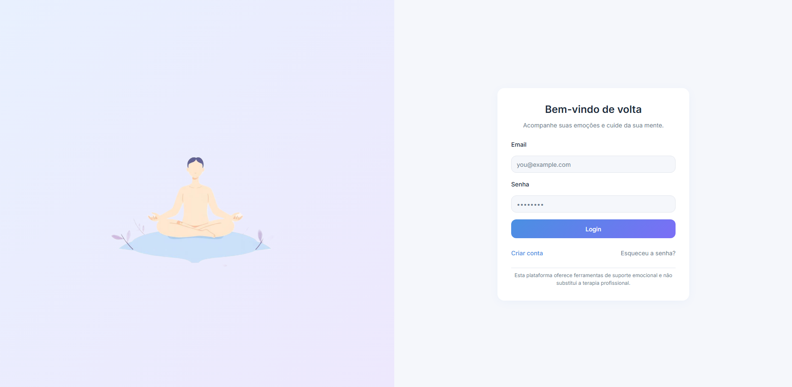   

### 5.1.2. Tela de Onboarding - Fluxo Inicial
* **Funcionalidade:** Integração e personalização da experiência do usuário.
* **Descrição:** Fluxo de onboarding com 6 passos progressivos que coleta informações sobre o usuário para personalizar sua experiência. Inclui:
  * **Passo 1:** Boas-vindas com apresentação do aplicativo
  * **Passo 2:** Identificação dos objetivos do usuário (autoconhecimento, gerenciar ansiedade, etc.)
  * **Passo 3:** Frequência de uso esperada
  * **Passo 4:** Áreas com as quais o usuário deseja receber suporte
  * **Passo 5:** Preferências de horário de notificações
  * **Passo 6:** Confirmação e salvamento das preferências
* 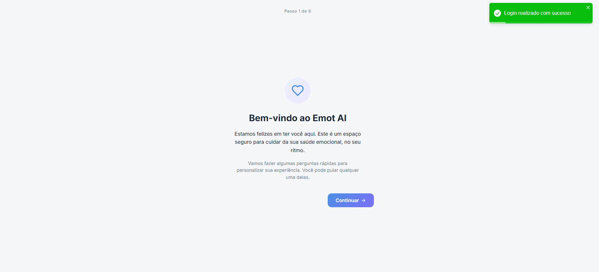
* 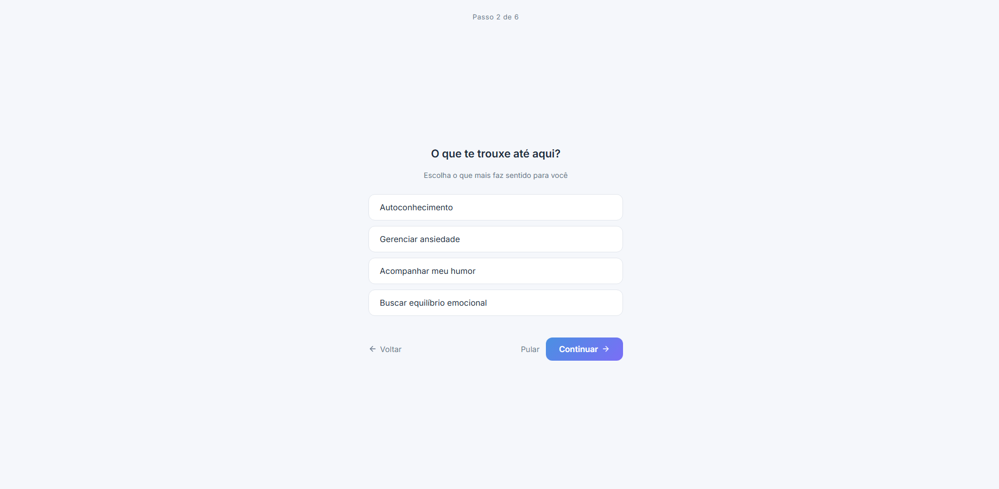
* 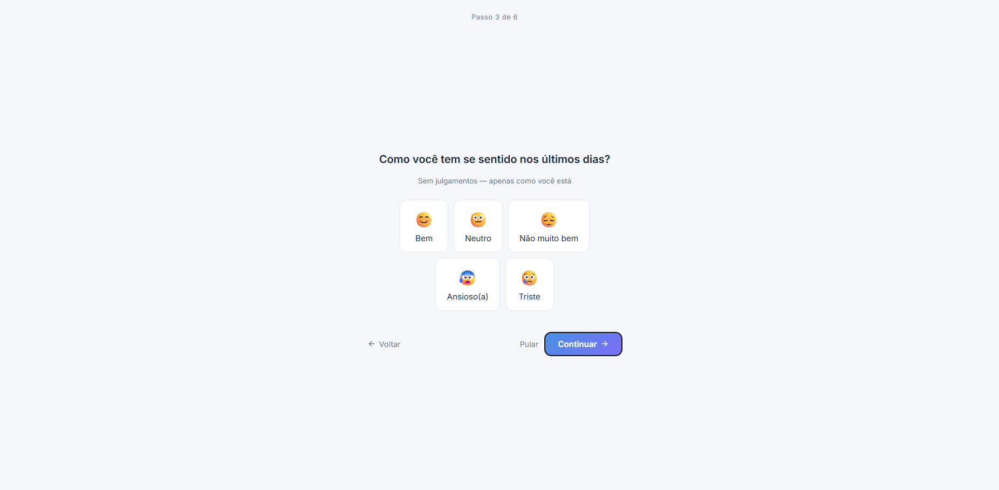
* 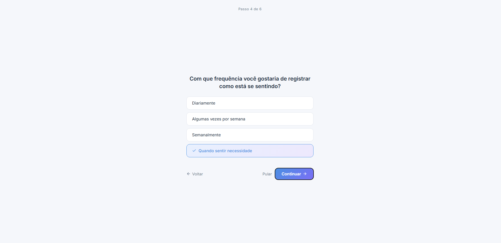
* 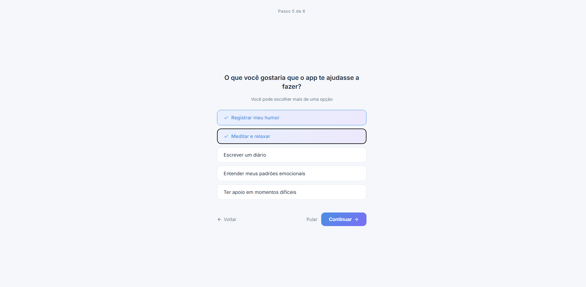
* 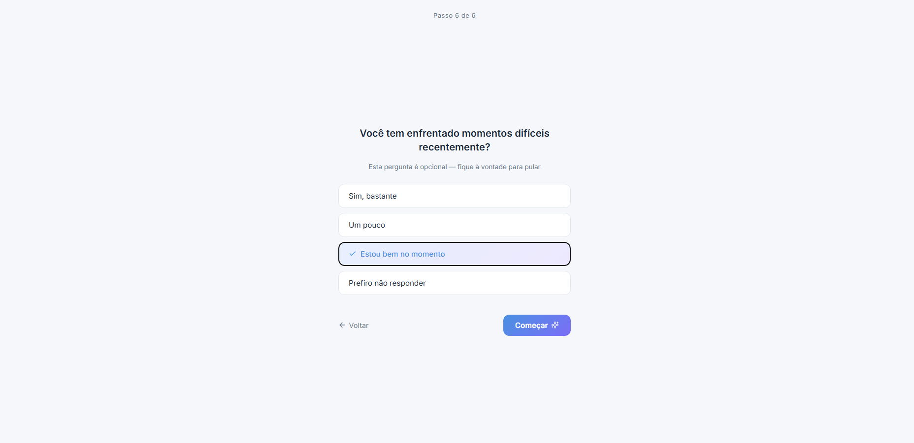   

> 💡 **Nota:** O onboarding valida as respostas e as envia para a API, salvando as preferências do usuário no banco de dados para uso futuro.

---

## 🟡 Sprint 2: MVP - Dashboard Principal e Registro de Emoções

Nesta sprint, foi implementado o dashboard principal com a funcionalidade de registro de emoções, permitindo ao usuário começar a usar o sistema para monitorar seu bem-estar emocional.

### 5.2.1. Tela Inicial (Home)
* **Funcionalidade:** Dashboard principal com registro diário de emoções e insights.
* **Descrição:** Tela inicial personalizada com boas-vindas ao usuário pelo nome. Exibe um seletor de humor interativo para o usuário registrar sua emoção atual, seguido por um painel de insights que mostra o panorama emocional do usuário. Também inclui dois atalhos principais:
  * **Setor de Registro Emocional:** Seletor de 5 humores principais (Ótimo, Bom, Okay, Triste, Estressado) com opção de adicionar anotações
  * **Panorama Emocional:** Gráfico/insights mostrando o padrão emocional do usuário
  * **Atalho "Acalme-se Agora":** Quick access para técnicas de respiração e meditação
  * **Atalho "Preciso de Ajuda":** Quick access para conversar com o assistente de IA
* 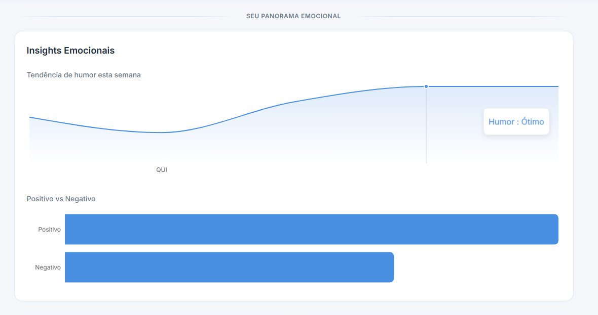
* 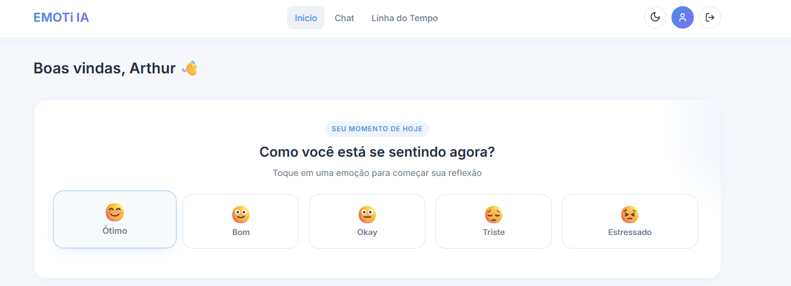
   

> 💡 **Nota:** O registro de emoção envia os dados para a API e atualiza imediatamente os insights. O usuário pode registrar múltiplas emoções durante o dia, e o sistema rastreia todas elas.

---

## 🔵 Sprint 3: Core - Chat com IA e Timeline Emocional

Nesta sprint, foram implementadas as funcionalidades mais complexas: o chat com assistente de IA para suporte emocional e a timeline para análise de padrões emocionais.

### 5.3.1. Tela de Chat com IA
* **Funcionalidade:** Suporte emocional em tempo real através de um assistente de IA.
* **Descrição:** Interface de chat seguro e acolhedor onde o usuário pode conversar com um assistente de IA treinado para oferecer suporte emocional. A tela apresenta:
  * **Histórico de Mensagens:** Conversa visual com mensagens do usuário e IA diferenciadas
  * **Ações Rápidas:** Botões com sugestões iniciais (ex: "Estou me sentindo ansioso(a)", "Estou triste", "Preciso conversar")
  * **Input de Mensagem:** Campo para digitar mensagens com indicador de digitação
  * **Carregamento de Histórico:** O chat carrega automaticamente a conversa do dia anterior
* 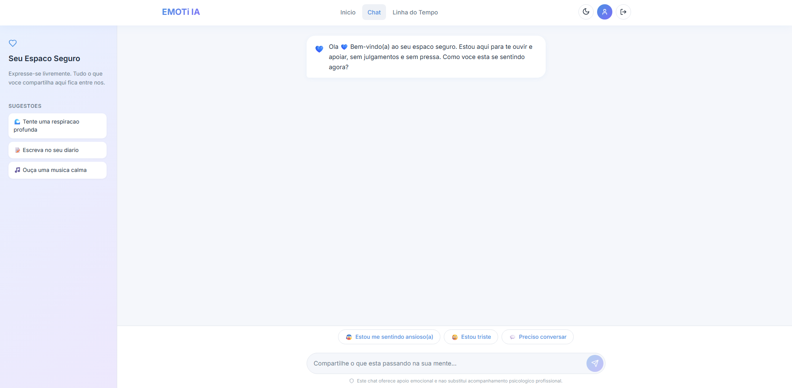
* 
*    

### 5.3.2. Tela de Timeline Emocional
* **Funcionalidade:** Visualização e análise de padrões emocionais ao longo do tempo.
* **Descrição:** Tela que apresenta todos os registros emocionais do usuário em uma linha do tempo organizada por semana. Permite filtrar por tipo de emoção e período, exibindo:
  * **Cartões de Entrada:** Cada registro de emoção mostra: emoji, intensidade, data/hora, e preview da anotação
  * **Filtros:** Possibilidade de filtrar por tipo de emoção (categoria) e período
  * **Agrupamento por Semana:** Entradas organizadas cronologicamente
  * **Detalhes Expandíveis:** Ao clicar, expande para mostrar o texto completo da anotação
* 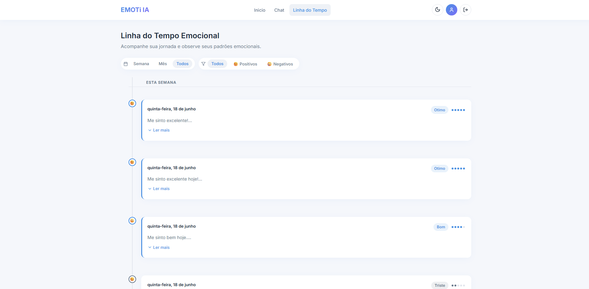
* 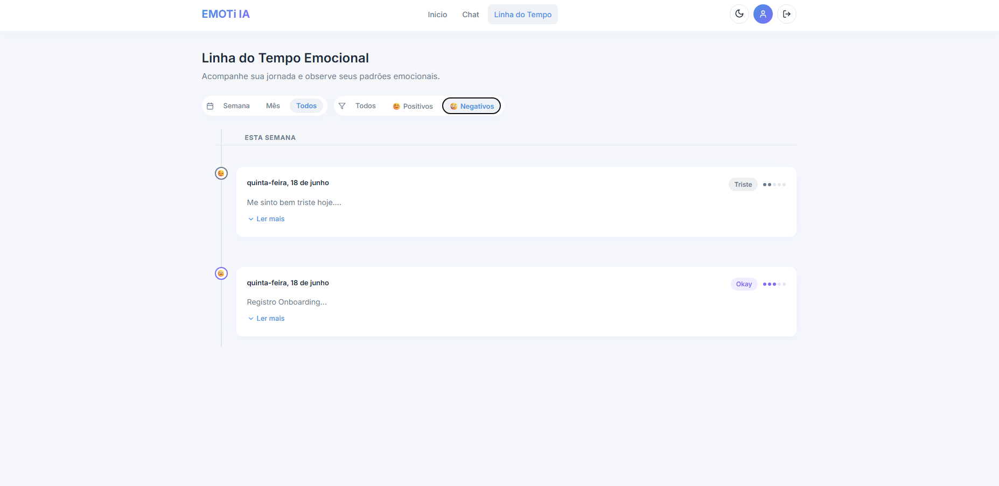   

> 💡 **Nota:** A timeline integra dados reais do banco de dados, mostrando o histórico completo de emoções registradas pelo usuário.

---

## 🔴 Sprint 4: Entrega Final - Perfil do Usuário e Refinamentos

Nesta sprint final, foi implementada a tela de perfil com visualização de padrões emocionais em calendário e refinamentos visuais em todo o sistema.

### 5.4.1. Tela de Perfil
* **Funcionalidade:** Visualização de padrões emocionais e informações do usuário.
* **Descrição:** Tela de perfil que apresenta uma visualização em calendário dos registros emocionais do usuário. Inclui:
  * **Informações do Usuário:** Nome do usuário com inicial em avatar circular
  * **Calendário de Emoções:** Visualização mensal com indicadores de humor para cada dia (intensidade e emoji)
  * **Navegação de Mês:** Botões para navegar entre meses anteriores e futuros
  * **Seletor de Data:** Ao clicar em um dia, exibe os detalhes da emoção registrada
  * **Modal de Detalhes:** Apresenta data completa (formatada em português), emoji, humor, intensidade e anotação (diary) associada
  * **Estatísticas:** Indicadores visuais como streak de dias, humores predominantes, e insights de tendências
* 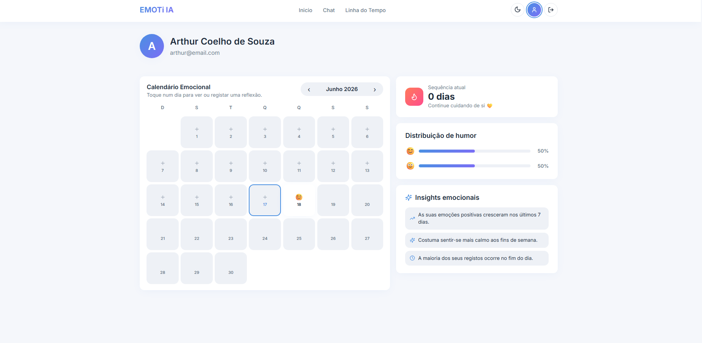
* 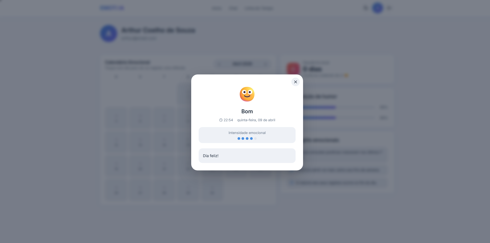   

### 5.4.2. Layout Autenticado
* **Funcionalidade:** Navegação e estrutura base do sistema autenticado.
* **Descrição:** Layout principal que envolve todas as páginas autenticadas (Home, Chat, Timeline, Profile). Inclui:
  * **Navegação Principal:** Menu lateral ou superior com acesso às diferentes seções
  * **Respons responsividade:** Design adaptável para diferentes tamanhos de tela
  * **Autenticação:** Verificação de token e logout
* 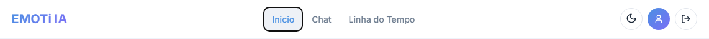   

> 💡 **Nota:** A tela de profile utiliza validação de intensidade de emoção para colorir o calendário, oferecendo uma visualização intuitiva da variação emocional ao longo do mês.

---

## 📸 Resumo de Telas Implementadas

| Tela | Sprint | Funcionalidade Principal |
|------|--------|------------------------|
| Login | Sprint 1 | Autenticação de usuário |
| Onboarding | Sprint 1 | Coleta de preferências iniciais |
| Home | Sprint 2 | Dashboard com registro de emoções |
| Chat | Sprint 3 | Suporte com IA em tempo real |
| Timeline | Sprint 3 | Histórico de emoções em linha do tempo |
| Profile | Sprint 4 | Visualização de padrões em calendário |
| Layout Autenticado | Sprint 4 | Navegação e estrutura base |

> 📸 **Dica:** Certifiquem-se de que as imagens tenham boa resolução e mostrem o sistema rodando no navegador. Salvem todas as imagens na pasta `images/` do repositório.

